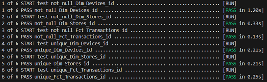

# Project

## Introduction

In this project **DBT** is used with **Snowflake database** to discover data and answer customers questions. Afterwards, as an extra mile, data was pulled from Snowflake to **Power BI** to do further analysis and present some KPIs visually.

---

## 1 Data Overview

### 1.1 Data Sets

There are **3 data sets**:

| Table        | Columns |
|--------------|--------|
| **Devices**  | `id`, `type`, `store_id` |
| **Transactions** | `id`, `device_id`, `product_name`, `product_sku`, `category_name`, `amount`, `status`, `card_number`, `cvv`, `created_at`, `happened_at` |
| **Stores**   | `id`, `name`, `address`, `city`, `country`, `created_at`, `typology`, `customer_id` |

From the first glimpse we have sensitive data like (card_number and cvv) that need to be 
Anonymized, more over we can normalize the data for to reduce data redundancy as we have a lot of repetition in product_SKU.  More over we have 

---

### 1.2 Data Quality Issues

- product_SKU should be unique for every product (this can be solved by many ways like doing composite concat for Eg) but this is not the case as the test verifies it should be unique. 
- Also some of the created_at data are before happened at assuming bad parsing. 
- File were converted to csv and Utf8 encoding to avoid any inconvenience. 

---

## 2 Data Modeling

  
*Figure 1: Star Schema Model*

### 2.1 Creating The Fact Table

#### 2.1.1 `fct_transactions`
- Removed: `product_name`, `category_name`
- Added: `store_id` via join with `devices`
- **PK**: `id`  
- **FKs**: `product_sku`, `device_id`, `store_id`  
- **Lineage**: `Devices`, `Transactions`

---

### 2.2 Creating Dimension Tables

#### 2.2.1 `dim_products`
- Normalized product data  
- **PK**: `product_sku`  
- **Lineage**: `Transactions`

#### 2.2.2 `dim_devices`
- **PK**: `id`  
- **Lineage**: `Devices`

#### 2.2.3 `dim_stores`
- **PK**: `id`  
- **Lineage**: `Stores`

---

### 2.3 Testing the Model’s Primary Keys

Using DBT built-in tests: to test Primary Key (unique, not null)

Primary Key Test

*Figure 3: DBT Test Output*

All tests passed as shown in Fig 3

---

## 3. Data Aggregation

### 3.1 Top 10 Stores by Transacted Amount

**Tables used** (Dim_Stores, Fct_Transactions)

To answer this  we need to get the Store id, Store name and the amount for these store from the transactions so we will definitely need to join the Fct_Transactions table. 

Start by selecting the desired columns from Stores and Transactions limiting to Top 10:

Joining transactions table(keeping in mind as it is already transacted amount so the status should be **accepted**:

Group by the Store Id and Store name and ordering the output descending by stores profit (the sum of amount transacted): 

Output: 

Figure 4 Top 10 Stores Results

As shown in (Fig 4) the top 10 stores with **Nec Ante Ltd** as the top store with profit **9383**. 

---

### 3.2 Top 10 Products Sold

**Tables used** (Fct_Transactions) 

To answer this we need to use the product_sku assuming we want to know the exact products by its sku not its name, The product_sku indicates to a unique product (regardless the data quality issue mentioned above).

Assuming the most products sold with accepted transactions we will select the product_sku and count of product sku (top 10) from Transactions table: 
 

As we need the products already sold so the status should be accepted so we make this condition grouping by product sku and ordering by sold_products (Count(product_sku):

**Output:**

Figure 5 Top 10 products sold

As we can observe in the output the top 10 product_skus by sold products. 

---

### 3.3 Average Transacted Amount per Store Typology and Country

**Tables used** (Dim_Stores, Fct_Transactions)

To answer this we would need the country, typology from the stores table(Dim_Stores) and the average of the transacted amount from the transactions table(Fct_Transactions).

First we are going to select the required fields and round the average of the amount to get only 2 decimal numbers for better observation:

Joining Fact Table Transactions (Fct_Transactions) to get the amount:

As we need the already transacted so status would be in accepted Grouping by country and typology, ordering by amount descending:

**Output:**

Figure 6 Average transacted amount per store typology and country

As shown in the output **Vietnam Beauty** has the most average amount.

---

### 3.4 Percentage of Transactions per Device Type

**Tables used** (Dim_Devices, Fct_Transactions)

To answer this we have to use the device type(1,2,3,4,5) from Dim_devices and to count Id transactions from Fct_Transactions. 

Count of the T.id as No.of.Transactions assuming all transactions regardless of their status will be counted as the device was used for it, and the same number we will take for each device type / the total number of all rows(by the help of over() function) * times 100 to get the percentage and rounding all that to get only 2 decimal numbers for better observation. 

**(Number of transactions for each device type/  all transaction) x 100 as percentage** 

**Example: if device 1 were used 500 times(number of transactions used device 1) and we have 2000 transactions(total transactions)**

 **device 1 percentage would be 500/2000 * 100 = 25%**

**Output:**

Figure 7 Percentage of transactions per device type

As Shown in (fig 7) device 4 have the most number of transactions(350) scoring 23.33%.  

---

### 3.5 Average Time for a Store to Perform First 5 Transactions

**Tables used** (Fct_Transactions)

To solve this we will need the store id and the happened at date(assuming that we want to over see when our customers trust our service regardless it is accepted or not) 

---

#### 3.4.1Creating The First CTE 

First step creating CTE ranked:

Selecting store id and our date(happened at) 

Using row_number window function (because it does not skip numbers) partition by store id (store that made the sale) order by the date (happened at as a timestamp) by default it will be ordered ascendingly. 

**Checking Ranked Table output:** 

Figure 8 Ranked Table Output

As shown in (fig 8) this is exactly what we want to see what we need to do now is to take the difference between the 2 timestamps (1 (the first transaction) and 5  the last transaction

#### 3.4.2 Creating The Second CTE 

Now we want to capture 1 & 5 as shown in (fig 8): 

What we will do is to make a case when with min() to capture is when row number(row_no) = 1 and max() to capture when row number = 5 

End as first date(first_date) = 1 and fifth date(fifth_date) = 5 from the first CTE(ranked):

Afterwards we set the row number to always be under 5 (as in fig8 we don’t want any transaction after that. Group by store id having count all = 5 as having runs after our query. 

#### 3.4.3 Selecting From First Five 

The final step is to select the average of difference between first and fifth dates and round them to two decimal numbers. 

**Output:**

Figure 9 Average time for a store to perform its first 5 transactions

Finally run all of the views using dbt run: 

Now the views are present in our snowflake database. 

---

## 4 Data Visualization and more insights  

With Snowflake Database connected to power bi we can grab out data for visualizations and further data discovery: 

Figure 10 Data visualization and further insights

As we can see in fig(9) after the data was ingested from Snowflake an interactive dashboard was created to dive deeper, discover more kpis and to be able to filter fast and effective. 

 

